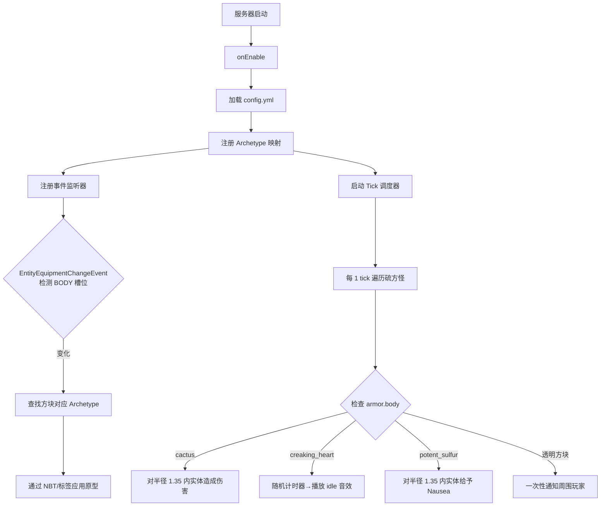

# Anything in Sulfur Cubes → Paper/Folia 插件移植计划

> 基于 Paper 26.2 实验版（build #48）+ Folia 26.1.2 | Gradle Kotlin DSL | Java 25

---

## 1. 研究结论

### 1.1 Minecraft 版本命名

Minecraft 26.2（夏季更新 "Vibrant Visuals"）采用了新版本号方案，不再是 `1.26.x` 格式。Paper 26.2 已发布实验性构建。

### 1.2 Paper API 对硫方怪的支持

**Paper 26.2 API 已完整支持硫方怪**，关键接口如下：

| API 接口 | 说明 |
|---|---|
| [`EntityType.SULFUR_CUBE`](https://jd.papermc.io/paper/26.2/org/bukkit/entity/EntityType.html#SULFUR_CUBE) | 硫方怪实体类型 |
| [`SulfurCube`](https://jd.papermc.io/paper/26.2/org/bukkit/entity/SulfurCube.html) | 硫方怪接口，继承 `AbstractCubeMob`、`Shearable`、`Bucketable`、`Ageable` |
| [`SulfurCube.Archetype`](https://jd.papermc.io/paper/26.2/org/bukkit/entity/SulfurCube.Archetype.html) | 原型接口，包含 12 个静态字段：`BOUNCY`、`EXPLOSIVE`、`FAST_FLAT`、`FAST_SLIDING`、`HIGH_RESISTANCE`、`HOT`、`LIGHT`、`REGULAR`、`SLOW_BOUNCY`、`SLOW_FLAT`、`SLOW_SLIDING`、`STICKY` |
| [`AbstractCubeMob`](https://jd.papermc.io/paper/26.2/org/bukkit/entity/AbstractCubeMob.html) | 抽象立方体生物，提供 `getSize()`、`setSize(int)`、`canWander()`、`setWander(boolean)` |
| [`Mob.getEquipment()`](https://jd.papermc.io/paper/26.2/org/bukkit/entity/Mob.html#getEquipment()) | 获取装备，可通过 `EquipmentSlot.BODY` 读取 armor.body 中的物品 |
| [`Frictional`](https://jd.papermc.io/paper/26.2/io/papermc/paper/entity/Frictional.html) | 摩擦力接口，`getFrictionState()` / `setFrictionState(TriState)` |

### 1.3 关键发现

数据包的核心机制分两层：

1. **方块 Archetype 映射**（~143 方块 → 12 种原型）—— 原版通过 `sulfur_cube_archetype` 物品标签实现，数据包扩展了标签内容。**Paper API 无直接的 `setArchetype()` 方法**，但 Archetype 通过原版物品标签系统驱动。
2. **4 种自定义 Tick 行为** —— 数据包的 mcfunction 逻辑，需要完全在插件中重新实现。

插件策略：
- **Archetype 映射**：插件在 `config.yml` 中维护方块→原型映射，通过生成物品标签文件或监听实体装备变更来应用
- **4 种自定义行为**：通过 Paper 的调度器系统实现每 tick 检测

---

## 2. 插件架构

```
src/main/java/com/github/lugosieben/anythinginsulfurcubes/
├── AnythingInSulfurCubesPlugin.java       # 主类，onEnable/onDisable
├── config/
│   └── PluginConfig.java                  # 配置管理，加载 config.yml
├── archetype/
│   ├── ArchetypeRegistry.java             # 方块→原型映射表（内存）
│   └── ArchetypeTagGenerator.java         # 生成硫方怪物品标签文件
├── listener/
│   └── SulfurCubeListener.java            # 实体装备变更监听器
├── scheduler/
│   ├── CactusBehavior.java                # 仙人掌伤害逻辑
│   ├── CreakingHeartBehavior.java         # 吱吱心音效逻辑
│   ├── PotentSulfurBehavior.java          # 强效硫磺效果逻辑
│   └── TransparencyNotifyBehavior.java    # 透明方块通知逻辑
└── util/
    └── SulfurCubeUtil.java                # 硫方怪工具方法
```

### config.yml 结构

```yaml
# 方块→原型映射（默认值来自 archetypes.json5）
block-archetypes:
  cactus: REGULAR
  creaking_heart: REGULAR
  potent_sulfur: REGULAR
  glass: REGULAR
  white_stained_glass: REGULAR
  # ... 所有 143+ 方块

# 自定义行为配置
behaviors:
  cactus:
    enabled: true
    damage: 1.0
    range: 1.35
  creaking-heart:
    enabled: true
    timer-min: 40
    timer-max: 100
    sound: minecraft:block.creaking_heart.idle
  potent-sulfur:
    enabled: true
    duration-seconds: 5
    amplifier: 1
    range: 1.35
  transparency-notify:
    enabled: true

# 透明方块列表
transparency-blocks:
  - glass
  - white_stained_glass
  - orange_stained_glass
  # ... 22 种透明方块
```

### 数据流



---

## 3. 详细实施步骤

### 步骤 1：创建项目骨架
- 创建 Gradle 项目（Kotlin DSL）
- 配置 `build.gradle.kts`：
  ```kotlin
  repositories {
      maven {
          name = "papermc"
          url = uri("https://repo.papermc.io/repository/maven-public/")
      }
  }
  dependencies {
      compileOnly("io.papermc.paper:paper-api:26.2.build.+")
  }
  java {
      toolchain.languageVersion.set(JavaLanguageVersion.of(25))
  }
  ```
- 配置 `plugin.yml`（name: `AnythingInSulfurCubes`, main class, api-version: 26.2）
- 配置 `gradle/wrapper/gradle-wrapper.properties`（Gradle 9.4.1）

### 步骤 2：实现主类 [`AnythingInSulfurCubesPlugin.java`]
- `onEnable()`：加载配置 → 注册 Archetype 映射 → 注册事件 → 启动调度器
- `onDisable()`：清理
- Folia 检测：通过反射检测 `FoliaClassLoader` 或 `Bukkit.getServer().getVersion()`

### 步骤 3：实现配置系统 [`PluginConfig.java`]
- 使用 Paper `Configurate` 或 Bukkit `ConfigurationSerialization`
- 生成默认配置（包含所有 143+ 方块映射原型值）
- 支持 `/aisc reload` 重载命令

### 步骤 4：实现 Archetype 系统
- [`ArchetypeRegistry.java`]：方块 Material → SulfurCube.Archetype 映射
- 应用策略：通过 `EntityEquipment.setItem(EquipmentSlot.BODY, itemStack)` 设置方块物品，让原版自动应用 Archetype 标签效果
- 可选：动态生成 `sulfur_cube_archetype` 物品标签 JSON 文件

### 步骤 5：实现 Cactus 伤害 [`CactusBehavior.java`]
- 使用 `Entity.getScheduler().runAtFixedRate(...)` 每 tick 执行
- 遍历世界中的所有硫方怪
- 检查 `equipment.getItem(EquipmentSlot.BODY)` 是否为 cactus
- 对 `location.getNearbyEntities(1.35, 1.35, 1.35)` 内的实体调用 `entity.damage(1.0, DamageSource.cactus())`

### 步骤 6：实现 Creaking Heart 音效 [`CreakingHeartBehavior.java`]
- 使用 `PersistentDataContainer` 存储每个硫方怪的计时器（PDC key）
- 每 tick 递减计时器
- 归零时播放 `minecraft:block.creaking_heart.idle` 音效
- 重置计时器为随机值 40~100 tick

### 步骤 7：实现 Potent Sulfur 效果 [`PotentSulfurBehavior.java`]
- 类似 Cactus，每 tick 检查硫方怪
- 对附近实体应用 `PotionEffect(PotionEffectType.NAUSEA, 100 ticks, 1)`

### 步骤 8：实现透明通知 [`TransparencyNotifyBehavior.java`]
- 使用 PDC 或全局布尔标志跟踪是否已触发
- 当检测到含有透明方块的硫方怪时，向附近玩家发送一次性消息
- 消息包含资源包下载链接（使用 Adventure Component API）

### 步骤 9：构建与打包
- 使用 `gradle build` 构建
- 输出 JAR 到 `build/libs/`

---

## 4. Folia 兼容策略

| Paper API | Folia 替代 |
|---|---|
| `Bukkit.getScheduler().runTaskTimer(plugin, task, 0L, 1L)` | `entity.getScheduler().runAtFixedRate(plugin, task, 1L, 1L)` |
| `BukkitRunnable` | `EntityScheduler` |
| `Bukkit.getWorlds()` | 仍然可用（全局操作） |
| 全局调度 | `Bukkit.getGlobalRegionScheduler().run(...)` |

检测方式：
```java
private boolean isFolia() {
    try {
        Class.forName("io.papermc.paper.threadedregions.RegionizedServer");
        return true;
    } catch (ClassNotFoundException e) {
        return false;
    }
}
```
